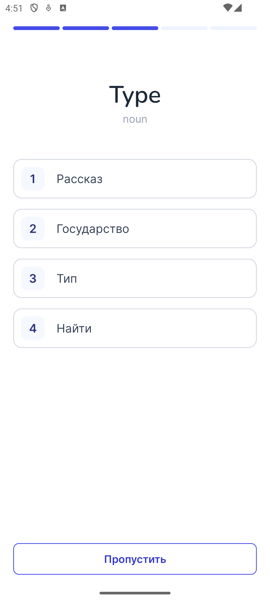

# Learn English Words App

<p align="center">
    
    
    
</p>


## Features

- Offline game "Guess the word" – 5 questions in which the user must choose the correct translation of the word from 4 provided options
- View the definition of each word, examples of its use and pronunciation


## Tech Stack

- Android XML
- Coroutines
- Dagger Hilt
- Retrofit
- Room
- MVVM
- Junit
- Robolectric
- Espresso


## Run Locally

Clone this repository and import into **Android Studio**

```bash
  git clone https://github.com/zotovy/learn_english_words_android
```

No additional configurations required


## Running Tests

To run unit tests, run the following command

```bash
  ./gradlew test
```

To run **UI** test, use Android Studio


## License

[MIT](License.md)


## Authors

[@zotovy](https://www.github.com/zotovy)

